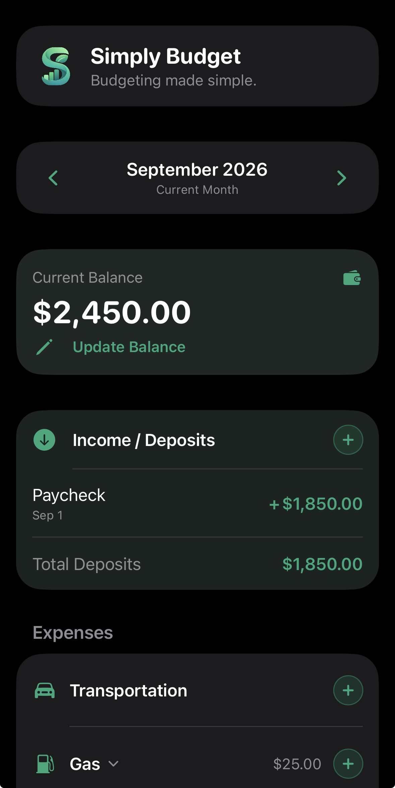
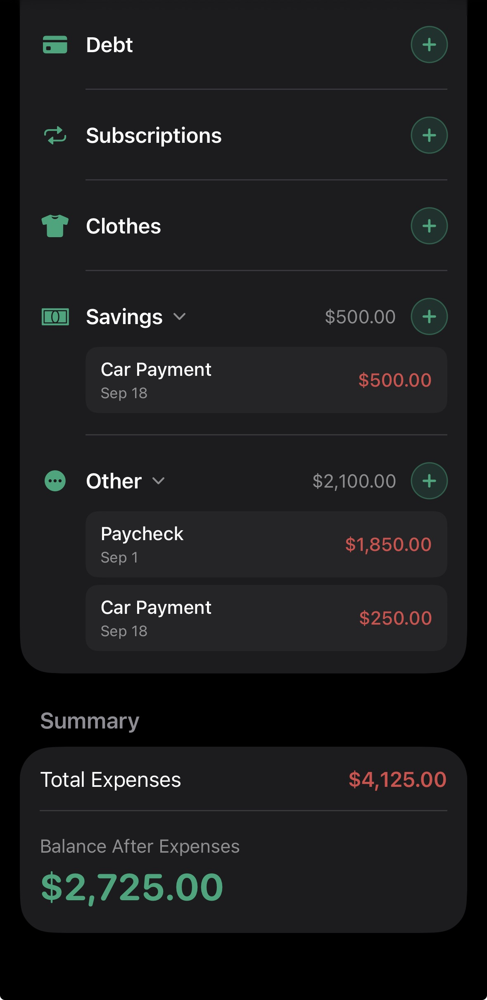

# Simply Budget

Simply Budget is a forward-looking budgeting and cash-flow planning app for iOS, built with Swift and SwiftUI.

The app allows users to manually plan upcoming income and expenses and see how those transactions affect their projected balance.

## Features

- Monthly budget planning
- Deposits and expenses
- Projected balance calculation
- Expense categories
- Transaction dates
- Edit and delete transactions
- Transaction name autocomplete
- Collapsible expense categories
- Persistent local data
- Dark Mode support

## Built With

- Swift
- SwiftUI
- Xcode
- Git & GitHub

## Project Status

Simply Budget is currently in development. This is my first independent SwiftUI project and is being built as a hands-on way to learn iOS development.
## Screenshots

  
  

